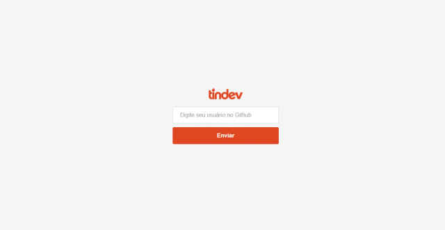
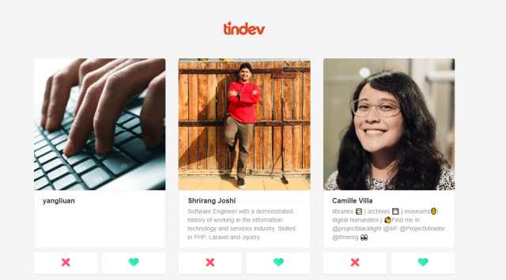
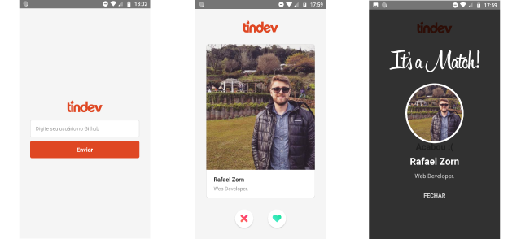

   <h3 align="center">tindev</h3>

---

## Overview

Application developed with React JS, React Native and NodeJS during Rocketseat's OmniStack week, it is a tinder to find developers.

## Backend

### Running the project

-   Access the backend directory
-   Install all dependencies using the command `yarn`
-   Run `yarn dev`
-   Fill the `.env` file
-   Access `http://localhost:3333/`

### Used technologies

-   Node
-   Express
-   Mongoose
-   Socket.IO
-   Other Node libs

## Frontend

### Preview

### Running the project

-   Access the frontend directory
-   Install all dependencies using the command `yarn`
-   Run `yarn start`
-   Access `http://localhost:3000/`

### Used technologies

-   React
-   React Router DOM
-   Socket.IO
-   Axios
-   Other React JS libs

## Mobile

### Preview

### Running the project

-   You need to set up all the react-native enviroment
-   Access the mobile directory
-   Install all dependencies using the command `yarn`
-   Run `react-native run-android` while you are running a Android emulator

### Used technologies

-   React Native
-   React Navigation
-   Socket.IO
-   Axios
-   Other React Native libs
